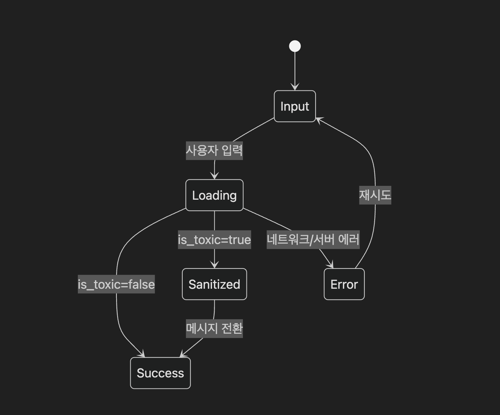
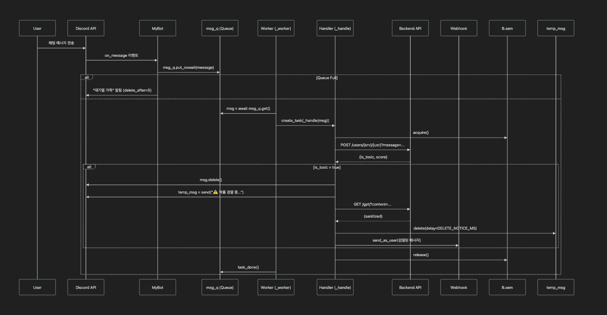

# discord_bot

## 개요
이 프로젝트는 Discord 서버에서 유저가 작성한 메시지를 백엔드 API로 분석하여, 부적절한(토큰 사용량 과다/악플 등) 메시지를 감지하고 검열된 형태로 다시 전송하는 봇입니다.  
- `analyze_message`: 메시지의 유해성을 판단  
- `transform_with_openai`: OpenAI API를 통해 문맥을 유지하면서 부적절한 표현을 순화  

## 준비물
- Python 3.8 이상  
- Discord Bot Token  
- 백엔드 API 서버 (유해성 판별 및 GPT 변환) URL  

## 봇 토큰 발급 방법

1. [Discord 개발자 포털](https://discord.com/developers/applications) 접속
2. **"New Application"** 클릭 → 이름 입력 후 생성
3. 왼쪽 메뉴에서 **"Bot"** 클릭 → **"Add Bot"** → 확인
4. 생성된 봇의 **"Token"**을 복사  
   - ⚠️ 이 토큰은 외부에 노출되지 않도록 `.env` 파일에만 저장하세요
   ```env
   DISCORD_TOKEN=your_bot_token_here
## 봇 초대 방법
1. 개발자 포털에서 해당 애플리케이션 선택
2. 왼쪽 메뉴에서 OAuth2 → URL Generator 클릭
3. 아래 항목을 설정:
- Scopes: bot
- Bot Permissions (권한):
  - Send Messages
  - Read Message History
  - Manage Messages
  - View Channels 
  - Manage Webhooks

생성된 URL을 복사해 웹 브라우저에 붙여넣고 원하는 Discord 서버에 초대

## 환경 설정 및 실행
1. 저장소를 클론 또는 다운로드  
   ```bash
   git clone <REPO_URL>
   cd <PROJECT_ROOT>

2. 의존성 설치
   ```bash
    pip install -r requirements.txt
3. .env 파일 생성 및 아래 항목 설정
    ```bash
    DISCORD_TOKEN= <YOUR_DISCORD_BOT_TOKEN>
    BACKEND_BASE_URL= https://agaricleaner.onrender.com
백엔드 레포지토리 주소: (https://github.com/ROOM1ghouls/AGaRiCleaner)
4. 실행
    ```bash
   python main.py
봇이 온라인 상태가 되면 콘솔에 [Bot Ready] Logged in as ... 메시지가 출력됩니다.


## 엔드포인트
| 구분                    | HTTP 메서드 | 경로                                          | 설명                           |
|-------------------------|-------------|-----------------------------------------------|--------------------------------|
| 메시지 유해성 분석      | POST        | /users/{server_id}/{user_id}?message=<content> | is_toxic, score 반환           |
| OpenAI 검열/순화 변환   | GET         | /gpt/?content=<content>                        | sanitized 텍스트 반환          |
⚠️ 실제 요청 URL은 .env의 BACKEND_BASE_URL을 기준으로 합니다.


## 다이어그램

### UI 상태 흐름 다이어그램



### 시스템 다이어그램



This project is licensed under the MIT License - see the [LICENSE](./LICENSE) file for details.